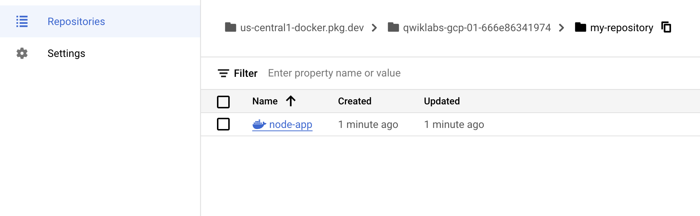

# Overview

Docker is an open platform for developing, shipping, and running applications. With Docker, you can separate your applications from your infrastructure and treat your infrastructure like a managed application. Docker helps you ship code faster, test faster, deploy faster, and shorten the cycle between writing code and running code.

Docker does this by combining kernel containerization features with workflows and tooling that helps you manage and deploy your applications.

Docker containers can be directly used in Kubernetes, which allows them to be run in the Kubernetes Engine with ease. After learning the essentials of Docker, you will have the skillset to start developing Kubernetes and containerized applications.

# What you'll learn

In this lab, you will learn how to do the following:
	* How to build, run, and debug Docker containers.
	* How to pull Docker images from Docker Hub and Google Artifact Registry.
	* How to push Docker images to Google Artifact Registry.

# Prerequisites

This is an introductory level lab. Little to no prior experience with Docker and containers is assumed. Familiarity with Cloud Shell and the command line is suggested, but not required. If you are looking for more advanced material in this service area, be sure to check out the following labs:

[App Dev: Deploying the Application into Kubernetes Engine - Python](https://www.cloudskillsboost.google/focuses/1073?parent=catalog)  

[Hello Node Kubernetes](https://www.cloudskillsboost.google/focuses/564?parent=catalog)  

[Managing Deployments Using Kubernetes Engine](https://www.cloudskillsboost.google/focuses/639?parent=catalog)  

Once you're ready, scroll down to get your lab environment set up.

# Task 1. Hello world

1. Open up Cloud Shell and enter the following command to run a hello world container to get started:

```
docker run hello-world
```


This simple container returns Hello from Docker! to your screen. While the command is simple, notice in the output the number of steps it performed. The Docker daemon searched for the hello-world image, didn't find the image locally, pulled the image from a public registry called Docker Hub, created a container from that image, and ran the container for you.

2. Run the following command to take a look at the container image it pulled from Docker Hub:

```
docker images
```

This is the image pulled from the Docker Hub public registry. The Image ID is in [SHA256 hash](https://www.movable-type.co.uk/scripts/sha256.html) format—this field specifies the Docker image that's been provisioned. When the Docker daemon can't find an image locally, it will by default search the public registry for the image.

3. Run the container again:


```
docker run hello-world
```


Notice the second time you run this, the Docker daemon finds the image in your local registry and runs the container from that image. It doesn't have to pull the image from Docker Hub.

4. Finally, look at the running containers by running the following command:

```
docker ps
```


There are no running containers. You already exited the hello-world containers you previously ran.

5. In order to see all containers, including ones that have finished executing, run docker ps -a:


```
docker ps -a
```


This shows you the Container ID, a UUID generated by Docker to identify the container, and more metadata about the run. The container Names are also randomly generated but can be specified with docker run --name [container-name] hello-world.


# Task 2. Build

In this section, you will build a Docker image that's based on a simple node application.

1. Execute the following command to create and switch into a folder named test.


```
mkdir test && cd test
```


2. Create a Dockerfile:


```
cat > Dockerfile <<EOF
# Use an official Node runtime as the parent image
FROM node:lts
# Set the working directory in the container to /app
WORKDIR /app
# Copy the current directory contents into the container at /app
ADD . /app
# Make the container's port 80 available to the outside world
EXPOSE 80
# Run app.js using node when the container launches
CMD ["node", "app.js"]
EOF
```

This file instructs the Docker daemon on how to build your image.

	* The initial line specifies the base parent image, which in this case is the official Docker image for node version long term support (lts).
	* In the second, you set the working (current) directory of the container.
	* In the third, you add the current directory's contents (indicated by the "." ) into the container.
	* Then expose the container's port so it can accept connections on that port and finally run the node command to start the application.


```
Note: Spend some time reviewing the [Dockerfile command references](https://docs.docker.com/engine/reference/builder/#known-issues-run) to understand each line of the Dockerfile.
```

Now you'll write the node application, and after that you'll build the image.

3. Run the following to create the node application:


```
cat > app.js <<EOF
const http = require('http');
const hostname = '0.0.0.0';
const port = 80;
const server = http.createServer((req, res) => {
    res.statusCode = 200;
    res.setHeader('Content-Type', 'text/plain');
    res.end('Hello World\n');
});
server.listen(port, hostname, () => {
    console.log('Server running at http://%s:%s/', hostname, port);
});
process.on('SIGINT', function() {
    console.log('Caught interrupt signal and will exit');
    process.exit();
});
EOF
```

This is a simple HTTP server that listens on port 80 and returns "Hello World".

Now build the image.

4. Note again the ".", which means current directory so you need to run this command from within the directory that has the Dockerfile:

```
docker build -t node-app:0.1 .
```

It might take a couple of minutes for this command to finish executing. When it does, your output should resemble the following:

The -t is to name and tag an image with the name:tag syntax. The name of the image is node-app and the tag is 0.1. The tag is highly recommended when building Docker images. If you don't specify a tag, the tag will default to latest and it becomes more difficult to distinguish newer images from older ones. Also notice how each line in the Dockerfile above results in intermediate container layers as the image is built.

5. Now, run the following command to look at the images you built:


```
docker images
```

Your output should resemble the following:

Notice node is the base image and node-app is the image you built. You can't remove node without removing node-app first. The size of the image is relatively small compared to VMs. Other versions of the node image such as node:slim and node:alpine can give you even smaller images for easier portability. The topic of slimming down container sizes is further explored in Advanced Topics. You can view all versions in the official repository [in node](https://hub.docker.com/_/node).


# Task 3. Run

1. In this module, use this code to run containers based on the image you built:


```
docker run -p 4000:80 --name my-app node-app:0.1
```

(Command Output)

```
Server running at http://0.0.0.0:80/
```

The --name flag allows you to name the container if you like. The -p instructs Docker to map the host's port 4000 to the container's port 80. Now you can reach the server at http://localhost:4000. Without port mapping, you would not be able to reach the container at localhost.

2. Open another terminal (in Cloud Shell, click the + icon), and test the server:


```
curl http://localhost:4000
```

(Command Output)

```
Hello World
```
The container will run as long as the initial terminal is running. If you want the container to run in the background (not tied to the terminal's session), you need to specify the -d flag.

3. Close the initial terminal and then run the following command to stop and remove the container:


```
docker stop my-app && docker rm my-app
```

4. Now run the following command to start the container in the background:

```
docker run -p 4000:80 --name my-app -d node-app:0.1
docker ps
```

(Command Output)

```
CONTAINER ID   IMAGE          COMMAND         
CREATED         ...  NAMES      
xxxxxxxxxxxx   node-app:0.1   "node app.js"  16   
seconds ago  ...  my-app   
````


Notice the container is running in the output of docker ps. You can look at the logs by executing docker logs [container_id].


```
Note: You don't have to write the entire container ID, as long as the initial characters uniquely identify the container. For example, you can execute docker logs 17b if the container ID is 17bcaca6f....
```

```
docker logs [container_id]
```

(Command Output)

```
Server running at http://0.0.0.0:80/
```


Now modify the application.

1. In your Cloud Shell, open the test directory you created earlier in the lab:


```
cd test
```


2. Edit app.js with a text editor of your choice (for example nano or vim) and replace "Hello World" with another string:


```
....
const server = http.createServer((req, res) => {
    res.statusCode = 200;
    res.setHeader('Content-Type', 'text/plain');
    res.end('Welcome to Cloud\n');
});
....
```


3. Build this new image and tag it with 0.2:


```
docker build -t node-app:0.2 .
```


(Command Output)

```
Step 1/5 : FROM node:lts  
 ---> 67ed1f028e71  
Step 2/5 : WORKDIR /app  
 ---> Using cache  
 ---> a39c2d73c807  
Step 3/5 : ADD . /app  
 ---> a7087887091f  
Removing intermediate container 99bc0526ebb0  
Step 4/5 : EXPOSE 80  
 ---> Running in 7882a1e84596  
 ---> 80f5220880d9  
Removing intermediate container 7882a1e84596  
Step 5/5 : CMD node app.js  
 ---> Running in f2646b475210  
 ---> 5c3edbac6421  
Removing intermediate container f2646b475210  
Successfully built 5c3edbac6421  
Successfully tagged node-app:0.2  
```


Notice in Step 2 that you are using an existing cache layer. From Step 3 and on, the layers are modified because you made a change in app.js.

4. Run another container with the new image version. Notice how we map the host's port 8080 instead of 80. You can't use host port 4000 because it's already in use


```
docker run -p 8080:80 --name my-app-2 -d node-app:0.2
docker ps
```


(Command Output)

```
CONTAINER ID     IMAGE             COMMAND            
CREATED             
xxxxxxxxxxxx     node-app:0.2      "node app.js"      
53 seconds ago      ...
xxxxxxxxxxxx     node-app:0.1      "node app.js"      
About an hour ago   ...
```


5. Test the containers:


```
curl http://localhost:8080
```

(Command Output)

```
Welcome to Cloud
```

6. And now test the first container you made:

```
curl http://localhost:4000
```

(Command Output)

```
Hello World
```


# Debug

Now that you're familiar with building and running containers, go over some debugging practices.

1. You can look at the logs of a container using docker logs [container_id]. If you want to follow the log's output as the container is running, use the -f option.


```
docker logs -f [container_id]
```


Sometimes you will want to start an interactive Bash session inside the running container.

2. You can use docker exec to do this. Open another terminal (in Cloud Shell, click the + icon) and enter the following command:

```
docker exec -it [container_id] bash
```

The -it flags let you interact with a container by allocating a pseudo-tty and keeping stdin open. Notice bash ran in the WORKDIR directory (/app) specified in the Dockerfile. From here, you have an interactive shell session inside the container to debug.

(Command Output)

```
root@xxxxxxxxxxxx:/app#
```


3. Look at the directory

`ls`

(Command Output)

`Dockerfile  app.js`

4. Exit the Bash session:

`exit`

5. You can examine a container's metadata in Docker by using Docker inspect:

`docker inspect [container_id]`

(Command Output)

```
[  
    {  
        "Id": "xxxxxxxxxxxx....",
        "Created": "2017-08-07T22:57:49.261726726Z",
        "Path": "node",
        "Args": [
            "app.js"
        ],
...

```

6. Use --format to inspect specific fields from the returned JSON. For example:


```
docker inspect --format='{{range .NetworkSettings.Networks}}{{.IPAddress}}{{end}}' [container_id]
```


(Example Output)

`192.168.9.3`

Be sure to check out the following Docker documentation resources for more information on debugging:

[Docker inspect reference](https://docs.docker.com/engine/reference/commandline/inspect/#examples)
[Docker exec reference](https://docs.docker.com/engine/reference/commandline/exec/)


# Task 5. Publish

Now you're going to push your image to the [Google Artifact Registry](https://cloud.google.com/artifact-registry). After that you'll remove all containers and images to simulate a fresh environment, and then pull and run your containers. This will demonstrate the portability of Docker containers.

To push images to your private registry hosted by Artifact Registry, you need to tag the images with a registry name. The format is <regional-repository>-docker.pkg.dev/my-project/my-repo/my-image.


Create the target Docker repository


1. You must create a repository before you can push any images to it. Pushing an image can't trigger creation of a repository and the Cloud Build service account does not have permissions to create repositories.

2. From the Navigation Menu, under CI/CD navigate to Artifact Registry > Repositories.

3. Click Create Repository.

4. Specify my-repository as the repository name.

5. Choose Docker as the format.

6. Under Location Type, select Region and then choose the location us-central1 (Iowa).

7. Click Create.


Configure authentication

Before you can push or pull images, configure Docker to use the Google Cloud CLI to authenticate requests to Artifact Registry.

1. To set up authentication to Docker repositories in the region us-central1, run the following command in Cloud Shell:


```
gcloud auth configure-docker us-central1-docker.pkg.dev
```


2. Enter Y when prompted.

The command updates your Docker configuration. You can now connect with Artifact Registry in your Google Cloud project to push and pull images.

Push the container to Artifact Registry
Run the following commands to set your Project ID and change into the directory with your Dockerfile.

```
export PROJECT_ID=$(gcloud config get-value project)
cd ~/test
```

2. Run the command to tag node-app:0.2.


```
docker build -t us-central1-docker.pkg.dev/$PROJECT_ID/my-repository/node-app:0.2 .
```


3. Run the following command to check your built Docker images.

```
docker images
```

(Command Output)


```
REPOSITORY                      TAG         IMAGE ID          CREATED
node-app                        0.2         76b3beef845e      22 hours
us-central1-....node-app:0.2    0.2         76b3beef845e      22 hours
node-app                        0.1         f166cd2a9f10      26 hours
node                            lts         5a767079e3df      7 days
hello-world                     latest      1815c82652c0      7 weeks
```


3. Push this image to Artifact Registry.


```
docker push us-central1-docker.pkg.dev/$PROJECT_ID/my-repository/node-app:0.2
```

Command output (yours may differ):


```
The push refers to a repository [us-central1-docker.pkg.dev/[project-id]/my-repository/node-app:0.2]
057029400a4a: Pushed
342f14cb7e2b: Pushed
903087566d45: Pushed
99dac0782a63: Pushed
e6695624484e: Pushed
da59b99bbd3b: Pushed
5616a6292c16: Pushed
f3ed6cb59ab0: Pushed
654f45ecb7e3: Pushed
2c40c66f7667: Pushed
0.2: digest: sha256:25b8ebd7820515609517ec38dbca9086e1abef3750c0d2aff7f341407c743c46 size: 2419
```


4. After the build finishes, from the Navigation Menu, under CI/CD navigate to Artifact Registry > Repositories.

5. Click on my-repository. You should see your node-app Docker container created:




Test the image

You could start a new VM, ssh into that VM, and install gcloud. For simplicity, just remove all containers and images to simulate a fresh environment.

1. Stop and remove all containers:


```
docker stop $(docker ps -q)
docker rm $(docker ps -aq)
```


You have to remove the child images (of node:lts) before you remove the node image.

2. Run the following command to remove all of the Docker images.


```
docker rmi us-central1-docker.pkg.dev/$PROJECT_ID/my-repository/node-app:0.2
docker rmi node:lts
docker rmi -f $(docker images -aq) # remove remaining images
docker images
```

(Command Output)

```
REPOSITORY          TAG                 IMAGE ID            CREATED             SIZE
```


At this point you should have a pseudo-fresh environment.

3. Pull the image and run it.


```
docker pull us-central1-docker.pkg.dev/$PROJECT_ID/my-repository/node-app:0.2
docker run -p 4000:80 -d us-central1-docker.pkg.dev/$PROJECT_ID/my-repository/node-app:0.2
curl http://localhost:4000
```

(Command Output)

`Welcome to Cloud`

Completed task
Click Check my progress to verify your performed task.You'll see the container image published to Artifact Registry


